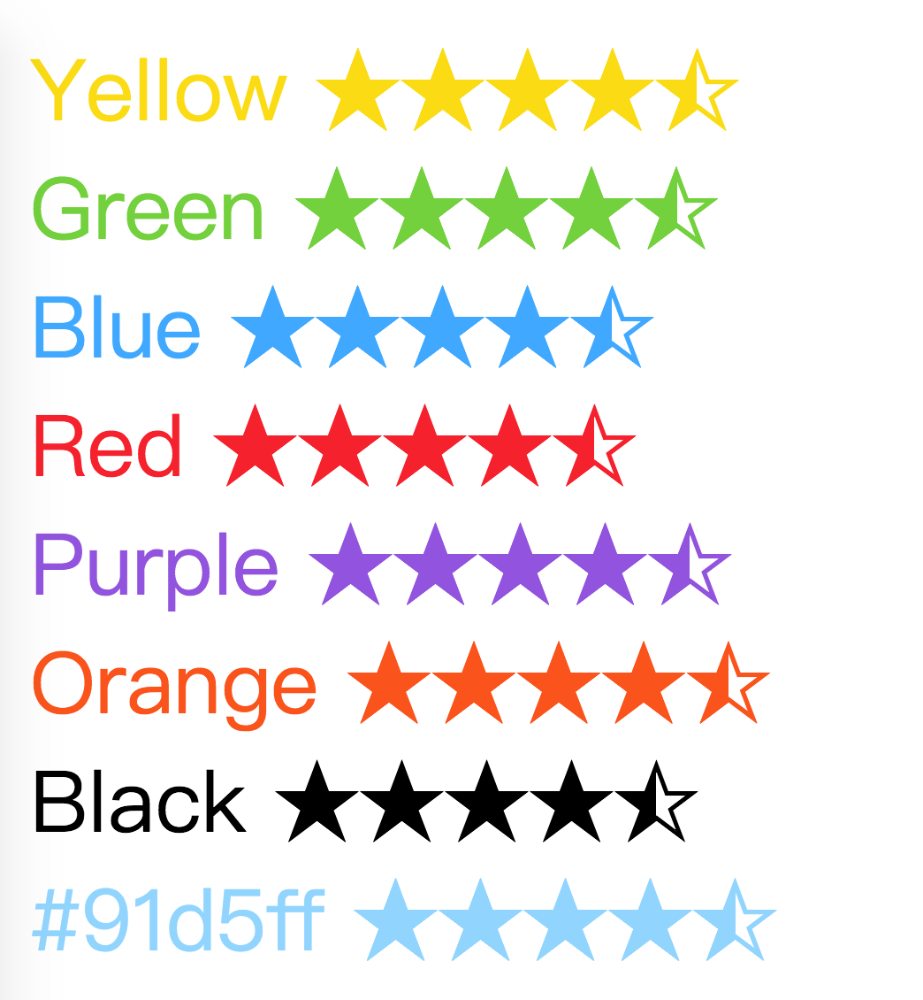

# Vue Tiny Rate


> The Smallest Rating Component for Vuejs


## Features

* based ☆ and ★
* theme
* animate
* size


## Translation

  -  [Chinese (Simplified)](./README_ch.md)


## Installation and usage

Once, install rate component for your project

```bash
npm install vue-tiny-rate --save
```

Import Vue Rate into your app

```javascript
import Rate from 'vue-tiny-rate';

new Vue({
    components: {
        Rate
    }
})
```

Use HTML template

```html
<Rate />
```


## Options from props

- `value {number|string}` : Star value `default:0`

```html
<Rate value="0.5"></Rate>
<Rate value="1"></Rate>
<Rate value="3.6"></Rate>
```


- `length {number|string}` : Star size `default:5`

```html
<Rate value="2" length="4"></Rate>
<Rate value="3.6" length="8"></Rate>
<Rate value="7.6" length="10"></Rate>
```


- `theme {color|enum('yellow','green','blue','red','purple','orange','black','wihte')}`: Star color. `default: yellow`

```html
<Rate value="4.5">Yellow</Rate>
<Rate value="4.5" theme="green">Green</Rate>
<Rate value="4.5" theme="blue">Blue</Rate>
<Rate value="4.5" theme="red">Red</Rate>
<Rate value="4.5" theme="purple">Purple</Rate>
<Rate value="4.5" theme="orange">Orange</Rate>
<Rate value="4.5" theme="black">Black</Rate>
<Rate value="4.5" theme="#91d5ff">#91d5ff</Rate>

```




- `size {number|string}`: Rate size. 

```html
<Rate value="4.5" size='12px'>12px</Rate>
<Rate value="4.5" size='16px'>16px</Rate>
<Rate value="4.5" size='20px'>20px</Rate>
<Rate value="4.5" size='40px'>40px</Rate>
```


- `animate {number|string}`: Rate animate duration. `default:0`

```html
<Rate value="3.5" animate='1'>1s</Rate>
<Rate value="3.5" animate='2'>2s</Rate>
<Rate value="3.5" animate='3'>3s</Rate>
```


## License

MIT.
# Vue Tiny Rate


## Translation

  -  [Chinese (Simplified)](./README_ch.md)

> The Smallest Rating Component for Vuejs

## Installation and usage

Once, install rate component for your project

```bash
npm install vue-tiny-rate --save
```

Import Vue Rate into your app

```javascript
import Rate from 'vue-tiny-rate';

new Vue({
    components: {
        Rate
    }
})
```

Use HTML template

```html
<Rate />
```


## Options from props

- `value {number|string}` : Star value `default:0`

```html
<Rate value="0.5"></Rate>
<Rate value="1"></Rate>
<Rate value="3.6"></Rate>
```


- `length {number|string}` : Star size `default:5`

```html
<Rate value="2" length="4"></Rate>
<Rate value="3.6" length="8"></Rate>
<Rate value="7.6" length="10"></Rate>
```


- `theme {color|enum('yellow','green','blue','red','purple','orange','black','wihte')}`: Star color. `default: yellow`

```html
<Rate value="4.5">Yellow</Rate>
<Rate value="4.5" theme="green">Green</Rate>
<Rate value="4.5" theme="blue">Blue</Rate>
<Rate value="4.5" theme="red">Red</Rate>
<Rate value="4.5" theme="purple">Purple</Rate>
<Rate value="4.5" theme="orange">Orange</Rate>
<Rate value="4.5" theme="black">Black</Rate>
<Rate value="4.5" theme="#91d5ff">#91d5ff</Rate>

```


- `size {number|string}`: Rate size. 

```html
<Rate value="4.5" size='12px'>12px</Rate>
<Rate value="4.5" size='16px'>16px</Rate>
<Rate value="4.5" size='20px'>20px</Rate>
<Rate value="4.5" size='40px'>40px</Rate>
```


- `animate {number|string}`: Rate animate duration. `default:0`

```html
<Rate value="3.5" animate='1'>1s</Rate>
<Rate value="3.5" animate='2'>2s</Rate>
<Rate value="3.5" animate='3'>3s</Rate>
```


## License

MIT.
